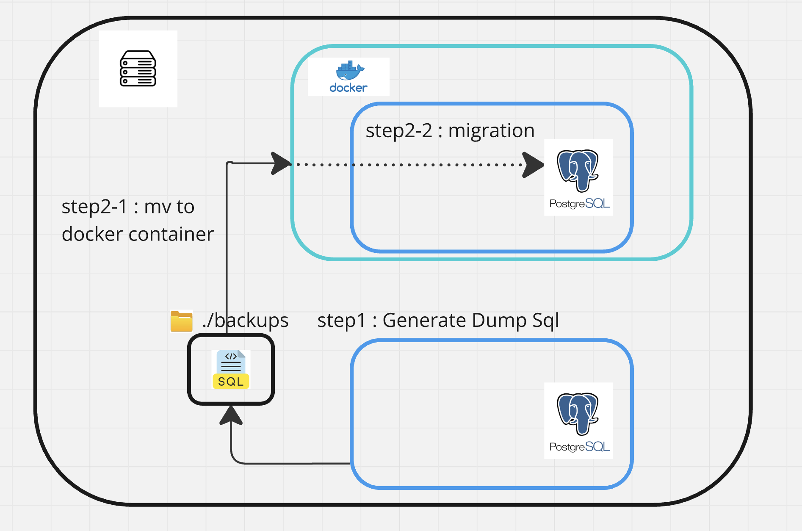

## **PostgreSQL를 Docker로 마이그레이션하는 스크립트**

### 프로젝트 설명

이 프로젝트는 온프레미스 환경에서 PostgreSQL 데이터베이스를 Docker 컨테이너로 원활하게 마이그레이션할 수 있는 Bash 스크립트를 제공합니다. 이 스크립트는 데이터베이스 덤프 과정을 자동화하고, Docker 컨테이너 내의 PostgreSQL 인스턴스로 데이터를 복원합니다. 기본값을 사용하여 간편하게 설정할 수 있어, 개발자와 시스템 관리자가 수동 작업 없이 데이터베이스를 손쉽게 이전할 수 있습니다.



#### 주요 기능:
- **인터랙티브 설정:** 사용자에게 설정 값을 인터랙티브하게 입력받으며, 기본값을 사용할 수 있는 옵션을 제공합니다.
- **자동 데이터베이스 덤프:** 로컬 환경에서 PostgreSQL 데이터베이스 덤프를 자동으로 수행합니다.
- **간편한 Docker 마이그레이션:** 덤프 파일을 Docker 컨테이너로 자동으로 복사하고, 데이터베이스를 복원합니다.

#### 요구 사항

이 프로젝트를 실행하기 위해 아래의 요구 사항을 충족해야 합니다:

##### 소프트웨어 요구 사항:
- **운영 체제:** Unix 기반 시스템 (Linux, macOS)
- **Bash:** 4.0 이상 버전
- **Docker:** 설치 및 실행 중이어야 함
- **PostgreSQL 클라이언트 도구:** 데이터베이스 덤프 생성을 위한 `pg_dump`
- **권한:** 로컬 PostgreSQL 데이터베이스에 접근하고 Docker와 상호작용할 수 있는 충분한 권한

##### 환경 요구 사항:
- **로컬 PostgreSQL 데이터베이스:** PostgreSQL 서비스가 실행 중이며 접근 가능해야 함.
- **Docker 컨테이너:** 대상 Docker 컨테이너가 실행 중이어야 하며, PostgreSQL 인스턴스가 설정되어 있어야 함.

#### 실행 방법

아래의 단계를 따라 스크립트를 실행하고 PostgreSQL 데이터베이스를 마이그레이션하세요:

##### 1단계: 저장소 클론

먼저, 이 프로젝트의 저장소를 로컬 머신에 클론합니다:

```bash
git clone <repository-url>
cd <repository-directory>
```

##### 2단계: 스크립트 실행 권한 부여
스크립트에 실행 권한을 부여합니다:

```bash
chmod +x migration.sh
```

##### 3단계: 스크립트 실행
스크립트를 실행하고, 인터랙티브한 프롬프트에 따라 데이터베이스 덤프 및 Docker 마이그레이션을 진행합니다:

```bash
./migration.sh
```

###### 인터랙티브 프롬프트:
각 스크립트는 다음과 같은 정보를 요청합니다:
- 옵션 1: 데이터베이스 덤프
    - **Database Name:** 덤프할 로컬 PostgreSQL 데이터베이스의 이름을 입력합니다.
    - **Database User:** PostgreSQL 데이터베이스 사용자를 입력합니다.
    - **Database Host:** 호스트 주소를 입력합니다 (기본값: localhost).
    - **Database Port:** 포트 번호를 입력합니다 (기본값: 5432).
    - **Database Password:** PostgreSQL 사용자의 비밀번호를 입력합니다.
    - **Backup Directory:** 덤프 파일이 저장될 디렉터리를 지정합니다 (기본값: ./backups).
<br>

- 옵션 2: Docker로 마이그레이션
    - **Docker Database Name:** Docker 컨테이너 내의 PostgreSQL 인스턴스에서 사용할 데이터베이스 이름을 입력합니다.
    - **Docker Database User:** Docker 컨테이너 내의 PostgreSQL 사용자를 입력합니다.
    - **Docker Database Password:** PostgreSQL 사용자의 비밀번호를 입력합니다.
    - **Docker Container Name:** PostgreSQL이 실행 중인 Docker 컨테이너의 이름을 지정합니다.
<br>

- 옵션 3: 종료
<br>

##### 4단계: 마이그레이션 확인
스크립트가 완료된 후, Docker 컨테이너 내의 PostgreSQL 인스턴스에 접속하여 데이터가 성공적으로 복원되었는지 확인합니다.

```bash
docker exec -it <container_name> psql -U <user> -d <database_name>
```

이후 SQL 쿼리를 실행하여 데이터의 무결성을 확인할 수 있습니다.

#### 문제 해결:

권한 문제: 스크립트를 실행하거나 PostgreSQL 데이터베이스에 접근하고 Docker와 상호작용하기 위한 충분한 권한이 있는지 확인하세요.
Docker 컨테이너가 실행 중이지 않음: 마이그레이션을 시작하기 전에 대상 Docker 컨테이너가 실행 중인지 확인하세요.